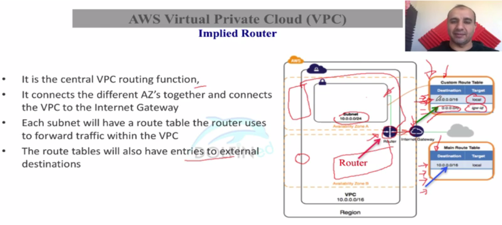

# AWS VPC

- vpc is region specific, cant span mult. regions. vpc can span mult. AZs
- vpc subnet is AZ specific. but AZs can have multiple subnets

## VPC Components

- Implied Router -to route the request to the vpc subnets 

  https://docs.aws.amazon.com/vpc/latest/userguide/VPC_Route_Tables.html

  Router will do two function implicitly

  - Routing Table
  - Nacl function

- Route Tables - to define rules for incoming and outgoing requests

- Internet Gateway - to communicate to the internet from vpc 

- Security Group - last defence at NIC (network interface card) (applied to an instance)

- Network Access Control List - First defence inside vpc (applied to a subnet)

- Virtual private Gateway - to connect private client networks

  

  

  ## IP Addressing

  - VPC CIDR block size (min /28 and max /16)

  - Reserved Ips in each Subnet (first four and last one , total 5)

  - ex. subnet cidr 10.0.0.0/24

    - 10.0.0.0 Base Network
    - 10.0.0.1 VPC router
    - 10.0.0.2 DNS related
    - 10.0.0.3 future use
    - 10.0.0.255 future use

  - Some of the private Ip address range

    - 10.0.0.0

    - 172.16.0.0

    - 192.168.0.0

      

  ## 

  ## Route Table

  - RT has default entry of CIDR block of vpc which can not be deleted

  - def. RT has one more entry towards Internet Gateway (0.0.0.0/0)

  - cust. RT dont have entry towards Internet Gateway

  - Route Table to Subnet Relationship - one to many

  - When you expand vpc with extra CIDR block, it will be added to RT automatically, 

    means cant be deleted its entries from main RT

  

  

  

## Internet Gateway

- https://docs.aws.amazon.com/vpc/latest/userguide/VPC_Internet_Gateway.html
- one internet Gateway per vpc, cant be connected to a mult vpc at a time
- you cant attach igw when vpc has already attached to an igw, first you have to detach it.

## VPC Types

- https://docs.aws.amazon.com/vpc/latest/userguide/VPC_Security.html

## Security Group

- acts as a Virtual Firewall

- Directional  - allow rules only

- Default sg of custom or default vpc has inbound rules which accepts traffic from the instance associated with same sg

- Custom sg of any vpc has default no inbound rules means inbound traffic prohibited

- Outbound rules allows all traffic to go from sg for all custom or default sg. You can delete this default rule.

- https://docs.aws.amazon.com/vpc/latest/userguide/VPC_SecurityGroups.html

  

  

  

  

  

  

## NACL (Network Access Control List)

- For def nacl (for def and cust vpc) – there is inbound and outbound traffic is allowed by default(0.0.0.0/0, allow in outbound and inbound entry)
- For cust nacl (for def and cust vpc) – there is explicit deny for inbound and outbound traffic.

|          | Def. VPC | Def. VPC | Cust. VPC | Cust. VPC |
| -------- | -------- | -------- | --------- | --------- |
| SG in    | same SG  |          | same SG   |           |
| SG out   |          |          |           |           |
| NACL in  |          |          |           |           |
| NACL out |          |          |           |           |

##### In above image..

- If traffic comes from internet gateway then routing table, nacl and sg will be involved for the security
- If inst. 3 wants to communicate with inst. 1 then nacl and sg wll be involved and rountng table will not be involved
- If inst 1 want to communicate with inst 2 then only security group will be involved